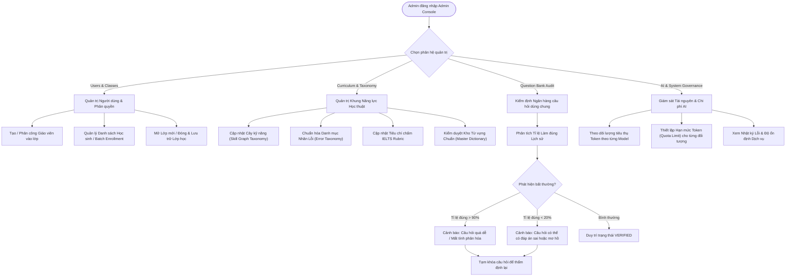

# Admin Flow Diagram

Sơ đồ mô tả quy trình vận hành của Quản trị viên (Admin Workflow) trong việc quản lý hệ thống, kiểm soát khung học thuật và giám sát chất lượng câu hỏi cùng hạn ngạch AI.

```mermaid
flowchart TD
    Start([Admin đăng nhập Admin Console]) --> MainHub{Chọn phân hệ quản trị}
    
    %% Phân hệ 1: Người dùng & Lớp học
    MainHub -- "Users & Classes" --> UserModule["Quản trị Người dùng & Phân quyền"]
    UserModule --> ManageTeachers["Tạo / Phân công Giáo viên vào lớp"]
    UserModule --> ManageStudents["Quản lý Danh sách Học sinh / Batch Enrollment"]
    UserModule --> ManageClasses["Mở Lớp mới / Đóng & Lưu trữ Lớp học"]
    
    %% Phân hệ 2: Khung học thuật
    MainHub -- "Curriculum & Taxonomy" --> CurriculumModule["Quản trị Khung Năng lực Học thuật"]
    CurriculumModule --> UpdateSkillGraph["Cập nhật Cây kỹ năng (Skill Graph Taxonomy)"]
    CurriculumModule --> UpdateErrorTaxonomy["Chuẩn hóa Danh mục Nhãn Lỗi (Error Taxonomy)"]
    CurriculumModule --> UpdateRubrics["Cập nhật Tiêu chí chấm IELTS Rubric"]
    CurriculumModule --> CurateDictionary["Kiểm duyệt Kho Từ vựng Chuẩn (Master Dictionary)"]
    
    %% Phân hệ 3: Kiểm định câu hỏi
    MainHub -- "Question Bank Audit" --> QBAudit["Kiểm định Ngân hàng câu hỏi dùng chung"]
    QBAudit --> AnalyzeSuccessRate["Phân tích Tỉ lệ Làm đúng Lịch sử"]
    AnalyzeSuccessRate --> FlagAbnormal{Phát hiện bất thường?}
    FlagAbnormal -- "Tỉ lệ đúng > 90%" --> FlagEasy["Cảnh báo: Câu hỏi quá dễ / Mất tính phân hóa"]
    FlagAbnormal -- "Tỉ lệ đúng < 20%" --> FlagHard["Cảnh báo: Câu hỏi có thể có đáp án sai hoặc mơ hồ"]
    FlagEasy & FlagHard --> DeactivateQ["Tạm khóa câu hỏi để thẩm định lại"]
    FlagAbnormal -- "Bình thường" --> MaintainQ["Duy trì trạng thái VERIFIED"]
    
    %% Phân hệ 4: Giám sát AI & Hạ tầng
    MainHub -- "AI & System Governance" --> AIGov["Giám sát Tài nguyên & Chi phí AI"]
    AIGov --> MonitorToken["Theo dõi lượng tiêu thụ Token theo từng Model"]
    AIGov --> SetQuota["Thiết lập Hạn mức Token (Quota Limit) cho từng đối tượng"]
    AIGov --> CheckLogs["Xem Nhật ký Lỗi & Độ ổn định Dịch vụ"]
```
