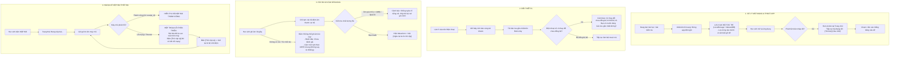

# Exception Handling & Disruption Recovery Diagram

Sơ đồ mô tả cơ chế tự phục hồi dữ liệu khi gặp sự cố mạng, đổi thiết bị, lỗi ghi âm hoặc thất bại khi nộp bài.

```mermaid
flowchart TD
    subgraph DISRUPTION_NETWORK["1. XỬ LÝ MẤT MẠNG & THOÁT APP"]
        InActivity["Đang làm bài học / bài kiểm tra"] --> DropNetwork["Mất kết nối mạng / Đóng app đột ngột"]
        DropNetwork --> LocalSave["LƯU CỤC BỘ TỨC THÌ (LocalStorage / IndexedDB)
        - Lưu từng câu trả lời & văn bản gõ dở"]
        
        LocalSave --> ReopenApp["Học sinh mở lại ứng dụng"]
        ReopenApp --> DetectDraft{"Phát hiện bản nháp dở?"}
        DetectDraft -- "Có" --> HeroResume["Hero Action tại Trang chủ:
        'Tiếp tục bài đang dở: [Tên bài] (Câu 4/10)'"]
        HeroResume --> ResumeAction["Chạm 1 lần vào thẳng đúng câu dở"]
    end

    subgraph DISRUPTION_DEVICE["2. ĐỔI THIẾT BỊ"]
        PhoneUse["Làm 5 câu trên Điện thoại"] --> SwitchPC["Mở Máy tính bàn cùng tài khoản"]
        SwitchPC --> FetchCloud["Tải bản lưu gần nhất trên Đám mây"]
        FetchCloud --> CheckConflict{"Điện thoại cũ có thay đổi chưa đồng bộ?"}
        CheckConflict -- "Có" --> WarnDialog["Cảnh báo: Có thay đổi chưa đồng bộ từ thiết bị cũ.
        Bạn có muốn dùng bản lưu gần nhất không?"]
        CheckConflict -- "Đã đồng bộ đủ" --> ResumePC["Tiếp tục làm bài mượt mà"]
    end

    subgraph DISRUPTION_AUDIO["3. RỦI RO GHI ÂM SPEAKING"]
        RecordMic["Học sinh ghi âm 30 giây"] --> LocalAudioBuffer["Ghi tạm vào bộ đệm âm thanh cục bộ"]
        LocalAudioBuffer --> AudioCheck{"Kiểm tra chất lượng file"}
        AudioCheck -- "Âm quá nhỏ (< 10dB) / Quá ồn" --> WarnAudio["Cảnh báo: Không nghe rõ tiếng nói. Hãy thử lại nơi yên tĩnh!"]
        AudioCheck -- "Đạt chuẩn" --> AllowReview["Hiện Waveform + Nút [Nghe lại trước khi nộp]"]
        
        RecordMic -- "Không có mic / Từ chối mic" --> OptOutMic["Bấm 'Không thể ghi âm lúc này'
        - Đánh dấu: Chưa đánh giá
        - Gán mức tạm theo CEFR chung (Không suy từ Writing)"]
    end

    subgraph DISRUPTION_SUBMIT["4. NGOẠI LỆ NỘP BÀI THẤT BẠI"]
        ClickSubmit["Học sinh bấm NỘP BÀI"] --> ShowLoading["Trạng thái: Đang nộp bài..."]
        ShowLoading --> SendServer["Gửi gói tin lên máy chủ"]
        SendServer --> ServerResult{"Máy chủ phản hồi?"}
        
        ServerResult -- "Thành công (Có receipt_id)" --> ShowSuccess["HIỂN THỊ: ĐÃ NỘP BÀI THÀNH CÔNG"]
        ServerResult -- "Lỗi mạng / Timeout" --> FailDialog["HỘP THOẠI LỖI THÂN THIỆN:
        'Bài làm đã lưu an toàn trên máy.
        Bấm [Thử nộp lại] khi có kết nối mạng'"]
        FailDialog --> ClickRetry["Bấm [Thử nộp lại] -> Gửi lại từ bộ nhớ đệm"]
        ClickRetry --> SendServer
    end
```
