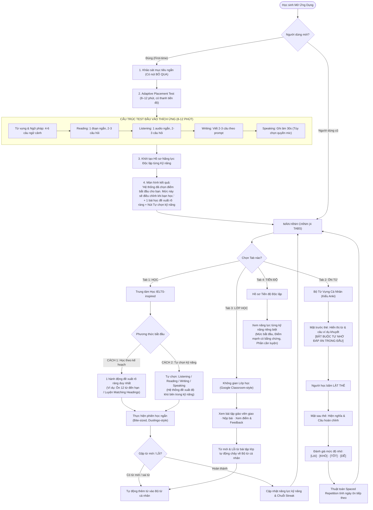

# Student Flow Diagram

Sơ đồ mô tả chi tiết hành trình của học sinh từ Onboarding tinh gọn (bài kiểm tra 8–12 phút), điều hướng 4 tab, đến hai phương thức bắt đầu học và vòng lặp flashcard Anki.

```mermaid
flowchart TD
    Start([Học sinh Mở Ứng Dụng]) --> CheckNew{Người dùng mới?}
    
    %% Luồng Onboarding tinh gọn
    CheckNew -- "Đúng (First-time)" --> OptionalGoal["1. Khảo sát mục tiêu ngắn (Có nút BỎ QUA)"]
    OptionalGoal --> PlacementTest["2. Adaptive Placement Test (8–12 phút, có thanh tiến độ)"]
    
    subgraph TestSections["CẤU TRÚC TEST ĐẦU VÀO THÍCH ỨNG (8-12 PHÚT)"]
        T1["Từ vựng & Ngữ pháp: 4-6 câu ngữ cảnh"]
        T2["Reading: 1 đoạn ngắn, 2-3 câu hỏi"]
        T3["Listening: 1 audio ngắn, 2-3 câu hỏi"]
        T4["Writing: Viết 2-3 câu theo prompt"]
        T5["Speaking: Ghi âm 30s (Tùy chọn quyền mic)"]
        T1 --> T2 --> T3 --> T4 --> T5
    end
    
    PlacementTest --> TestSections
    TestSections --> InitProfile["3. Khởi tạo Hồ sơ Năng lực Độc lập từng Kỹ năng"]
    InitProfile --> WelcomeScreen["4. Màn hình kết quả:
    'Hệ thống đã chọn điểm bắt đầu cho bạn. Mức này sẽ điều chỉnh khi bạn học.'
    + 1 bài học đề xuất rõ ràng + Nút Tự chọn kỹ năng"]
    
    WelcomeScreen --> MainApp
    CheckNew -- "Người dùng cũ" --> MainApp["MÀN HÌNH CHÍNH (4 TABS)"]
    
    %% Điều hướng 4 Tabs
    MainApp --> NavChoice{Chọn Tab nào?}
    
    %% Tab 1: HỌC
    NavChoice -- "Tab 1: HỌC" --> LearnHub["Trung tâm Học IELTS-inspired"]
    LearnHub --> EntryPath{Phương thức bắt đầu}
    EntryPath -- "CÁCH 1: Học theo kế hoạch" --> PlanAction["1 hành động đề xuất rõ ràng duy nhất
    (Ví dụ: Ôn 12 từ đến hạn / Luyện Matching Headings)"]
    EntryPath -- "CÁCH 2: Tự chọn kỹ năng" --> PickSkill["Tự chọn: Listening / Reading / Writing / Speaking
    (Hệ thống đề xuất độ khó bên trong kỹ năng)"]
    
    PlanAction & PickSkill --> PracticeSession["Thực hiện phiên học ngắn (Bite-sized, Duolingo-style)"]
    PracticeSession --> CheckFeedback{Gặp từ mới / Lỗi?}
    CheckFeedback -- "Có từ mới / sai từ" --> PushVocab["Tự động thêm từ vào Bộ từ cá nhân"]
    CheckFeedback -- "Hoàn thành" --> UpdateSkills["Cập nhật năng lực kỹ năng & Chuỗi Streak"]
    
    %% Tab 2: ÔN TỪ
    NavChoice -- "Tab 2: ÔN TỪ" --> AnkiHub["Bộ Từ Vựng Cá Nhân (Kiểu Anki)"]
    AnkiHub --> ShowFront["Mặt trước thẻ: Hiển thị từ & câu ví dụ khuyết
    [BẮT BUỘC TỰ NHỚ ĐÁP ÁN TRONG ĐẦU]"]
    ShowFront --> FlipCard["Người học bấm LẬT THẺ"]
    FlipCard --> ShowBack["Mặt sau thẻ: Hiện nghĩa & Câu hoàn chỉnh"]
    ShowBack --> RateMemory["Đánh giá mức độ nhớ:
    [LẠI] · [KHÓ] · [TỐT] · [DỄ]"]
    RateMemory --> AdjustInterval["Thuật toán Spaced Repetition tính ngày ôn tiếp theo"]
    
    %% Tab 3: LỚP HỌC
    NavChoice -- "Tab 3: LỚP HỌC" --> ClassHub["Không gian Lớp học (Google Classroom-style)"]
    ClassHub --> ClassActions["Xem bài tập giáo viên giao · Nộp bài · Xem điểm & Feedback"]
    ClassActions --> PushClassMistakes["Từ mới & Lỗi từ bài tập lớp tự động chảy về Bộ từ cá nhân"]
    PushClassMistakes --> PushVocab
    
    %% Tab 4: TIẾN ĐỘ
    NavChoice -- "Tab 4: TIẾN ĐỘ" --> ProgressHub["Hồ sơ Tiến độ Độc lập"]
    ProgressHub --> ViewIndependent["Xem năng lực từng kỹ năng riêng biệt
    (Mức bắt đầu, Điểm mạnh có bằng chứng, Phần cần luyện)"]
    
    UpdateSkills & AdjustInterval --> MainApp
```
