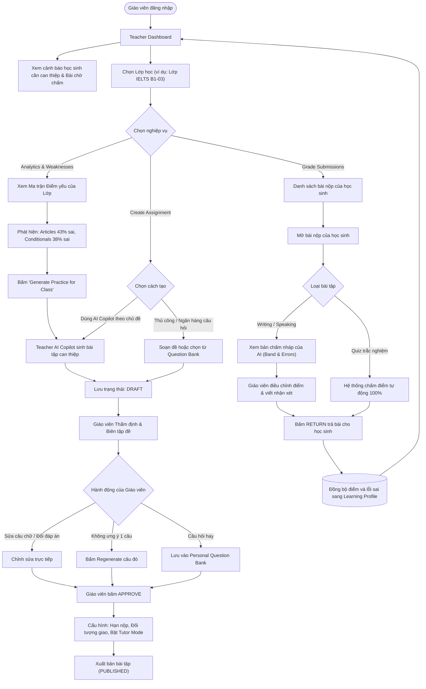

# Teacher Flow Diagram

Sơ đồ mô tả quy trình làm việc của giáo viên, tập trung vào vòng lặp phân tích dữ liệu lớp học, soạn bài tập với AI Copilot, quy trình duyệt bài và chấm bài.

```mermaid
flowchart TD
    Start([Giáo viên đăng nhập]) --> Dashboard["Teacher Dashboard"]
    
    Dashboard --> ViewAlerts["Xem cảnh báo học sinh cần can thiệp & Bài chờ chấm"]
    Dashboard --> SelectClass["Chọn Lớp học (ví dụ: Lớp IELTS B1-03)"]
    
    SelectClass --> ClassTabs{Chọn nghiệp vụ}
    
    %% Tab 1: Phân tích lớp & AI Copilot
    ClassTabs -- "Analytics & Weaknesses" --> ViewDiagnostics["Xem Ma trận Điểm yếu của Lớp"]
    ViewDiagnostics --> WeaknessData["Phát hiện: Articles 43% sai, Conditionals 38% sai"]
    WeaknessData --> ClickGenerate["Bấm 'Generate Practice for Class'"]
    ClickGenerate --> AICopilot["Teacher AI Copilot sinh bài tập can thiệp"]
    
    %% Tab 2: Tạo bài tập
    ClassTabs -- "Create Assignment" --> CreateChoice{Chọn cách tạo}
    CreateChoice -- "Thủ công / Ngân hàng câu hỏi" --> ManualDraft["Soạn đề hoặc chọn từ Question Bank"]
    CreateChoice -- "Dùng AI Copilot theo chủ đề" --> AICopilot
    
    %% Quy trình kiểm duyệt AI (Human-in-the-loop)
    AICopilot --> DraftState["Lưu trạng thái: DRAFT"]
    ManualDraft --> DraftState
    
    DraftState --> TeacherReview["Giáo viên Thẩm định & Biên tập đề"]
    TeacherReview --> ReviewAction{Hành động của Giáo viên}
    ReviewAction -- "Sửa câu chữ / Đổi đáp án" --> EditInline["Chỉnh sửa trực tiếp"]
    ReviewAction -- "Không ưng ý 1 câu" --> SingleRegen["Bấm Regenerate câu đó"]
    ReviewAction -- "Câu hỏi hay" --> SaveQB["Lưu vào Personal Question Bank"]
    
    EditInline & SingleRegen & SaveQB --> ApproveAssignment["Giáo viên bấm APPROVE"]
    ApproveAssignment --> ConfigPublish["Cấu hình: Hạn nộp, Đối tượng giao, Bật Tutor Mode"]
    ConfigPublish --> PublishAssignment["Xuất bản bài tập (PUBLISHED)"]
    
    %% Tab 3: Chấm bài
    ClassTabs -- "Grade Submissions" --> ListSubmissions["Danh sách bài nộp của học sinh"]
    ListSubmissions --> SelectSubmission["Mở bài nộp của học sinh"]
    SelectSubmission --> CheckType{Loại bài tập}
    
    CheckType -- "Quiz trắc nghiệm" --> AutoScore["Hệ thống chấm điểm tự động 100%"]
    CheckType -- "Writing / Speaking" --> AIPreGrade["Xem bản chấm nháp của AI (Band & Errors)"]
    
    AIPreGrade --> TeacherOverride["Giáo viên điều chỉnh điểm & viết nhận xét"]
    TeacherOverride --> ReturnAction["Bấm RETURN trả bài cho học sinh"]
    AutoScore --> ReturnAction
    
    ReturnAction --> UpdateProfile[("Đồng bộ điểm và lỗi sai sang Learning Profile")]
    UpdateProfile --> Dashboard
```
